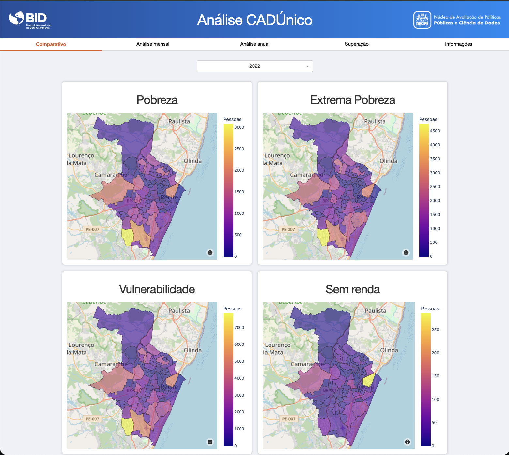
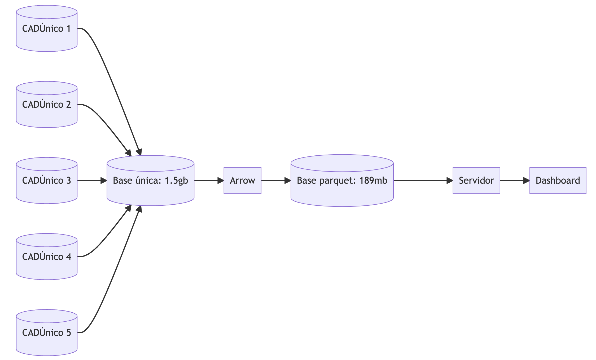
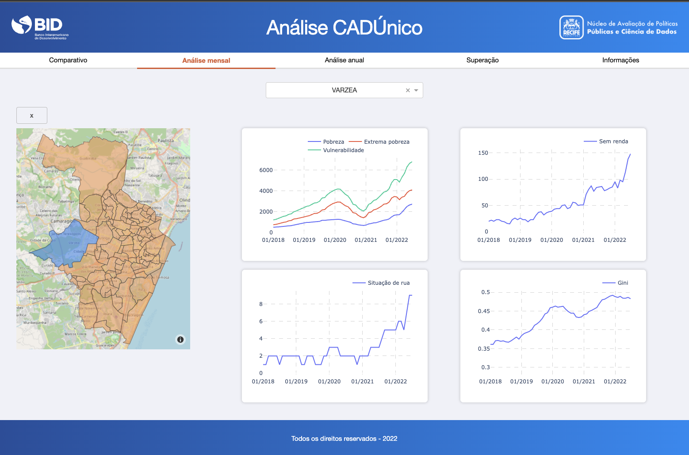
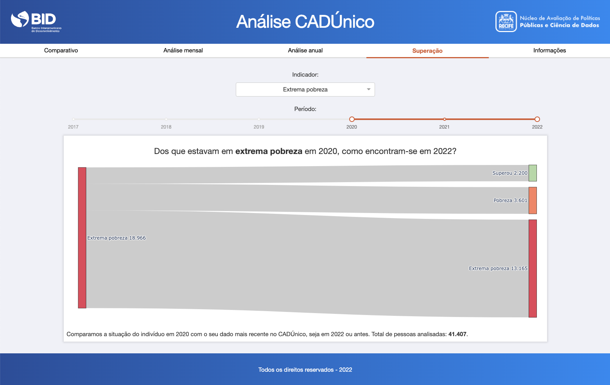

[](https://sonarcloud.io/summary/new_code?id=EL-BID_analise-cadunico)

# PoC Programa Bom de Morar



## Tabela de Conteúdo:
---

- [Descrição](#descricao)
- [Guia do usuário](#guia-do-usuario)
- [Guia de instalação](#guia-de-instalacao)
- [Autores](#autores)
- [Licença](#licenca)

## Descrição <a name="descricao"></a>
---


Um dos principais objetivos do plano de governo da prefeitura do Recife  é reduzir os índices de vulnerabilidade social. Uma dificuldade está em acompanhamento de resultados de políticas públicas. Grande parte dessa limitação se dá pela a falta de conjunto de dados de mensurar de forma eficiente os indicadores sociais necessários.

Uma das grandes vantagens da prefeitura do Recife é a disponibilidade do CadÚnico. Contudo, ferramentas tradicionais como planilhas eletrônicas são ineficientes para operacionalizar esse conjunto de dados, dificultando a manipulação dos dados, e dessa forma, atrasando o processo de geração de informação útil para a tomada de decisão.

A PoC aqui apresentada é um dashboard capaz de construir diversos indicadores de vulnerabilidade de forma automática. A aplicação irá calcular os seguintes indicadores:

- Pobreza
- Extrema pobreza
- Vulnerabilidade
- Ausência de renda
- Situação de rua
- Coeficiente de Gini

Foram construídas visualizações interativas que permitem filtros, desagregações e análises temporais. Por causa do armazenamento eficiente dos dados, a interação com a ferramenta é rápida. Dessa maneira, o usuário pode explorar os dados de maneira intuitiva e tomar decisões com base em dados.

### Dados

Para a construção dessa solução, foram utilizadas cinco versões históricas do CadÚnico, todas armazenadas em formato de planilha eletrônica, cada uma contendo cerca de 500,000 observações. Esses dados contém informações de famílias cadastradas entre 2016 até 2022. 

Os dados foram agregados em um único banco, fazendo uso de formato moderno e eficiente de armazenamento, o *parquet*. Utilizando esse formato foi possível reduzir de forma considerável o espaço ocupado pelos dados. Adicionalmente, o formato *parquet* permite acesso rápido e eficiente aos dados, mesmo para consultas complexas.



## Guia do Usuário <a name="guia-do-usuario"> </a>
---

Na primeira página, são exibidos 6 mapas choroplets que mostram de forma comparativa a situação de todos os bairros do Recife em relação a cada indicador. É possível selecionar um ano específico para a análise.


Na segunda página, gráficos com séries temporais dos indicadores mostrando o acumulado de 12 meses e com a possibilidade de filtro por bairro.



Na terceira página, um gráfico que mostra o percentual de pessoas que superaram a pobreza, a extrema pobreza, a vulnerabilidade e a situação de rua entre dois momentos no tempo.




## Guia de Implementação  <a name="guia-do-implementacao"> </a>
---

A implementação da aplicação de Análise do CadÚnico é bastante simples. Os passos necessários são:

1. Download do software `Python` e as bibliotecas necessárias;
2. Download dos códigos-fonte da aplicação;
3. Disponibilização do banco de dados CadÚnico;
4. Execução da aplicação.

### Download de software

A aplicação foi escrita na linguagem [Python](https://www.python.org), e utilizando principalmente as seguintes bibliotecas para a criação do dashboard:

- `dash`
- `dash-bootstrap-components`
- `pyarrow`
- `pandas`

Para mais detalhes sobre as bibliotecas e versões, vide o arquivo `requirements.txt` no diretório principal.

### Clonando repositório remoto

É possível realizar o download dos arquivos da aplicação através do 
repositório remoto do GitHub. Através da linha de commando:

```sh 
git clone <url>
```

### Organizando bancos de dados

A pasta com os arquivos da aplicação contêm todos os códigos necessários para rodar a aplicação, contudo, por questões de segurança da informação, os dados não são disponibilizados neste repositório. É necesário que o usuário salve uma base do CadÚnico em formato *parquet* e então coloque o arquivo no diretório `/
dados`.

### Executando a aplicação

Com os bancos de dados no formato apropriado e salvo nas respectivas pastas,
o último passo para executar a aplicação é executar o arquivo `app.py`.

Através da linha de comando, execute:

```sh
python app.py
```


## Autores <a name="autores"></a>
---

- [Rubens Lopes](mailto:lps.rubens@gmail.com "e-mail")
- [Cleyton Farias](mailto:cleytonfarias@outlook.com "e-mail")


## Licença
---
